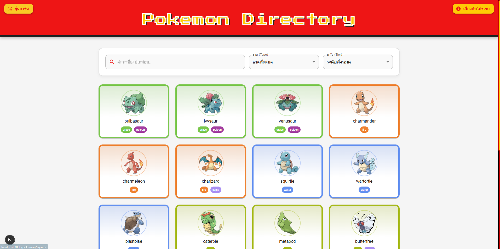
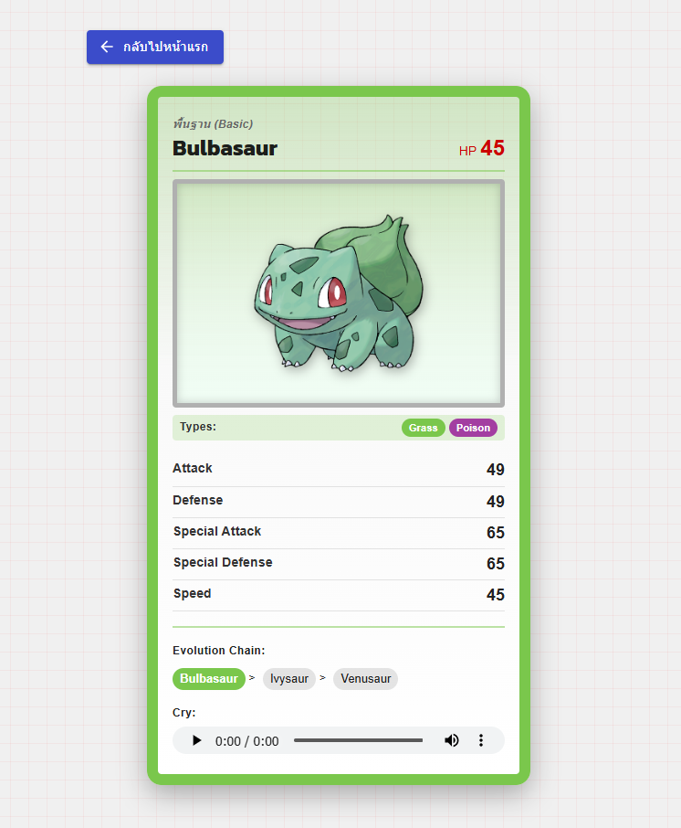
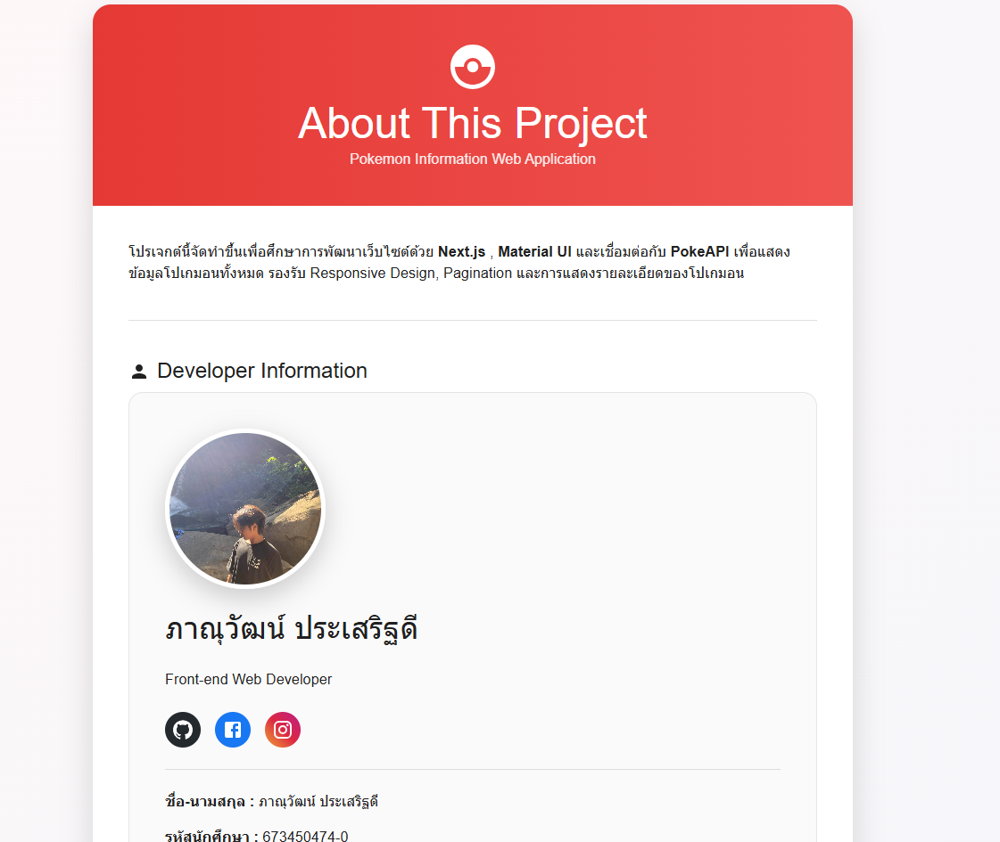

🧩 Pokemon Directory Project (Next.js & PokeAPI)

A modern web application developed with Next.js, TypeScript, and Material UI, utilizing the official PokeAPI to display Pokémon information in a clean, responsive, and user-friendly interface.

📖 Project Overview

This project was developed as part of the Front-end Web Programming course to practice modern web development using the React ecosystem.

The application retrieves Pokémon data from the official PokeAPI and presents detailed information including Pokémon images, statistics, evolution chains, cries, and more.

✨ Features
🔍 Browse 1351+ Pokémon from the official PokeAPI
📄 Detailed Pokémon information page
🖼️ Official Pokémon artwork
📊 Base Stats display with progress bars
🏷️ Pokémon Types
🌱 Evolution Chain
🔊 Pokémon Cry Audio
📑 Pagination using API offset and limit
⚡ Loading Skeleton while fetching data
📱 Fully Responsive Design
🎨 Modern UI built with Material UI
ℹ️ About Developer page
🌙 Clean and user-friendly interface
🛠️ Technologies Used
Technology	Description
Next.js	React Framework
TypeScript	Programming Language
Material UI (MUI)	UI Component Library
PokeAPI	Pokémon REST API
Axios / Fetch API	API Requests
React Skeleton	Loading Placeholder
📸 Screenshots
Home Page

Pokémon Detail

About Page

📂 Project Structure
pokemon-project/
│
├── public/
│   ├── images/
│   │   └── profile.jpg
│   ├── 
│   ├── 
│   └── 
│
├── src/
│   ├── app/
│   ├── components/
│   ├── lib/
│   └── types/
│
├── package.json
├── tsconfig.json
└── README.md
🚀 Getting Started
1. Clone the repository
git clone https://github.com/panuwat05/pokemon-project
2. Navigate to the project
cd pokemon-project
3. Install dependencies
npm install

or

yarn install
4. Run the development server
npm run dev

Open your browser and visit

http://localhost:3000
🌐 API Reference

This project uses the official PokeAPI.

https://pokeapi.co/

Example Endpoint

https://pokeapi.co/api/v2/pokemon
📚 Course Information
Item	Information
Course	Front-end Web Programming
Program	Computer Science and Information Technology
Faculty	Faculty of Interdisciplinary Studies
University	Khon Kaen University, Nong Khai Campus
👨‍💻 Developer Information
Information	Details
Name	ภาณุวัฒน์ ประเสริฐดี
Student ID	673450474-0
Program	Computer and Information Science
Faculty	Faculty of Interdisciplinary Studies
University	Khon Kaen University, Nong Khai Campus
Contact
GitHub: https://github.com/panuwat05
Facebook: https://www.facebook.com/panuwat.prasertdee
Instagram: https://www.instagram.com/txgxr_panu/
🎯 Learning Objectives

This project demonstrates knowledge of:

Next.js App Router
TypeScript
React Components
Client-side Data Fetching
REST API Integration
Material UI
Responsive Web Design
Pagination
Dynamic Routing
State Management using React Hooks
📄 License

This project was developed for educational purposes as part of the Front-end Web Programming course at Khon Kaen University, Nong Khai Campus.

⭐ Acknowledgements
Pokémon and Pokémon character data are provided by PokeAPI.
Pokémon is © Nintendo, Game Freak, and Creatures Inc.
Thanks to the React, Next.js, and Material UI communities for providing excellent open-source tools.